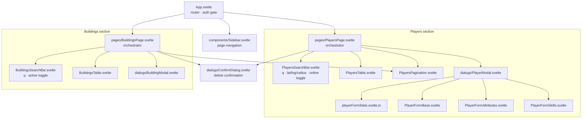

# Admin Panel

Svelte 5 admin UI for managing players and buildings. Source: [admin/src/](../admin/src/)

## Build

```bash
cd admin && npm run build
```

Build runs `svelte-check --tsconfig ./tsconfig.json` before `vite build` — TypeScript errors block the build.
Output is written to `server/static/admin/`.

## Structure



## Components

| Component | Responsibility |
|---|---|
| `App.svelte` | Auth gate — shows `LoginDialog` until authenticated; routes to pages |
| `components/Sidebar.svelte` | Left nav (`<nav>` + `<ul>/<li>` + `<button>`), page links with `aria-current` |
| `pages/PlayersPage.svelte` | State owner: players list, pagination, search filters, modal/confirm state |
| `pages/PlayersSearchBar.svelte` | Search inputs (text, geo coords, radius) + online-only toggle + reset |
| `pages/PlayersTable.svelte` | Renders player rows; loading/empty states |
| `pages/PlayersPagination.svelte` | Prev/next buttons, page X/Y display, result range label |
| `pages/BuildingsPage.svelte` | State owner: buildings list, pagination, search filters, modal/confirm state |
| `pages/BuildingsSearchBar.svelte` | Search input (text) + active-only toggle + reset |
| `pages/BuildingsTable.svelte` | Renders building rows with edit/delete actions |
| `dialogs/PlayerModal.svelte` | Create/edit player modal; delegates form fields to sub-components |
| `dialogs/playerFormState.svelte.ts` | `PlayerFormState` interface, `FORM_DEFAULTS`, `populateForm(form, player)` |
| `dialogs/PlayerFormBase.svelte` | Base fields: username, password, unit type, faction, role, alive, HP |
| `dialogs/PlayerFormAttributes.svelte` | 10 attribute fields rendered via `{#each}` |
| `dialogs/PlayerFormSkills.svelte` | 5 skill fields rendered via `{#each}` |
| `dialogs/BuildingModal.svelte` | Create/edit building modal (type, name, lat, lng, revealRadius, faction, active) |
| `dialogs/ConfirmDialog.svelte` | Generic yes/no confirmation modal |
| `dialogs/LoginDialog.svelte` | Admin login form |
| `lib/api.ts` | `apiFetch` (JWT header injection + auto-refresh), `safeJson` |
| `lib/auth.svelte.ts` | Token store, login/logout helpers |
| `lib/i18n.svelte.ts` | Admin UI strings (EN/RU) |
| `lib/toast.svelte.ts` | Toast notification state |
| `lib/types.ts` | `Player`, `Building` types |
| `components/ui/Spinner.svelte` | Loading spinner |
| `components/ui/Badge.svelte` | Status badge (faction / alive / online) |

## API

### Players

| Method | Endpoint | Description |
|---|---|---|
| `GET` | `/admin/api/users` | List with pagination and filters |
| `GET` | `/admin/api/users/:id` | Single player |
| `POST` | `/admin/api/users` | Create player |
| `PUT` | `/admin/api/users/:id` | Update player |
| `DELETE` | `/admin/api/users/:id` | Delete player |

Query params for `GET /admin/api/users`: `page`, `limit`, `q`, `lat`, `lng`, `radius`, `online`

### Buildings

| Method | Endpoint | Description |
|---|---|---|
| `GET` | `/admin/api/buildings` | List with pagination and filters |
| `POST` | `/admin/api/buildings` | Create building |
| `PUT` | `/admin/api/buildings/:id` | Update building |
| `DELETE` | `/admin/api/buildings/:id` | Delete building |

Query params for `GET /admin/api/buildings`: `page`, `limit`, `q`, `active`

## Semantic markup

- `<nav>` contains `<ul role="list">` / `<li>` / `<button>` — no `<div role="button">` anti-patterns
- Active nav item has `aria-current="page"`
- Decorative icons have `aria-hidden="true"`
- Lang toggle buttons have `aria-pressed`
- Sidebar header/footer use `<header>` / `<footer>`
