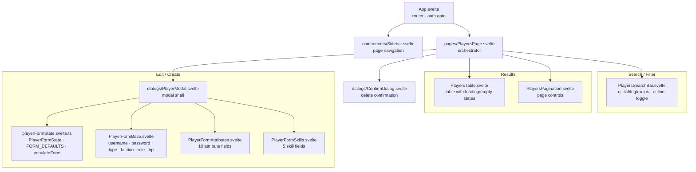

# Admin Panel

Svelte 5 admin UI for managing players. Source: [admin/src/](../admin/src/)

## Build

```bash
cd admin && npm run build
```

Build runs `svelte-check --tsconfig ./tsconfig.json` before `vite build` — TypeScript errors block the build.
Output is written to `server/static/admin/`.

## Structure



## Components

| Component | Responsibility |
|---|---|
| `App.svelte` | Auth gate — shows `LoginDialog` until authenticated; routes to pages |
| `components/Sidebar.svelte` | Left nav, page links |
| `pages/PlayersPage.svelte` | State owner: players list, pagination, search filters, modal/confirm state |
| `pages/PlayersSearchBar.svelte` | Search inputs (text, geo coords, radius) + online-only toggle + reset |
| `pages/PlayersTable.svelte` | Renders player rows; handles loading/empty states; `fmtCoords`, `fmtDate` helpers |
| `pages/PlayersPagination.svelte` | Prev/next buttons, page X/Y display, result range label |
| `dialogs/PlayerModal.svelte` | Create/edit player modal; delegates form fields to sub-components |
| `dialogs/playerFormState.svelte.ts` | `PlayerFormState` interface, `FORM_DEFAULTS`, `populateForm(form, player)` |
| `dialogs/PlayerFormBase.svelte` | Base fields: username, password, unit type, faction, role, alive, HP |
| `dialogs/PlayerFormAttributes.svelte` | 10 attribute fields rendered via `{#each}` |
| `dialogs/PlayerFormSkills.svelte` | 5 skill fields rendered via `{#each}` |
| `dialogs/ConfirmDialog.svelte` | Generic yes/no confirmation modal |
| `dialogs/LoginDialog.svelte` | Admin login form |
| `lib/api.ts` | `apiFetch` (JWT header injection), `safeJson` |
| `lib/auth.svelte.ts` | Token store, login/logout helpers |
| `lib/i18n.svelte.ts` | Admin UI strings |
| `lib/toast.svelte.ts` | Toast notification state |
| `lib/types.ts` | `Player` type |
| `components/ui/Spinner.svelte` | Loading spinner |
| `components/ui/Badge.svelte` | Status badge |

## API

Admin UI calls `GET /admin/api/users` with query params:

| Param | Type | Description |
|---|---|---|
| `page` | number | Page number (1-based) |
| `limit` | number | Items per page (20) |
| `q` | string | Text search |
| `lat`, `lng`, `radius` | number | Geo filter |
| `online` | `"true"` | Filter online-only |

CRUD: `POST /admin/api/users`, `PUT /admin/api/users/:id`, `DELETE /admin/api/users/:id`
