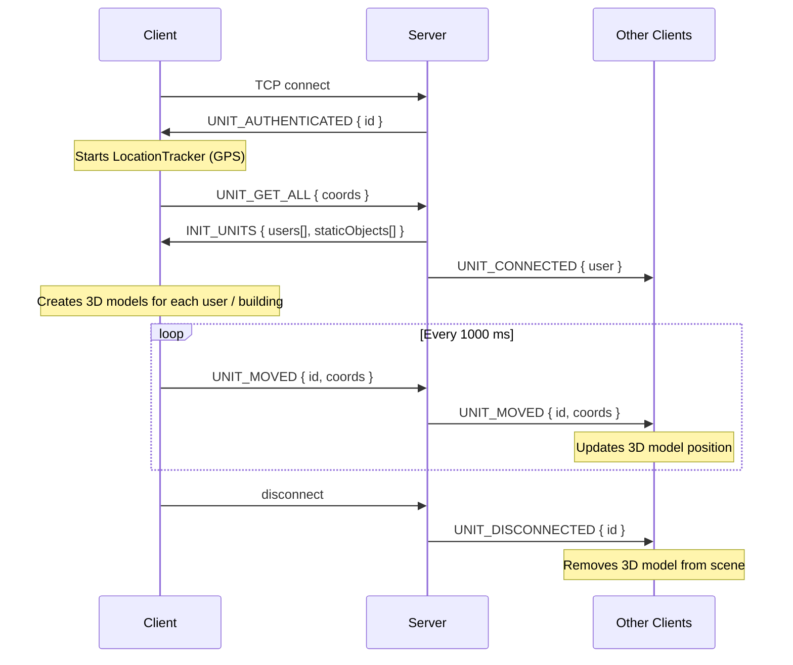

# Architecture

## Message Flow



## WebSocket Message Types

| Type | Direction | Payload | Description |
|------|-----------|---------|-------------|
| `UNIT_AUTHENTICATED` | S → C | `{ id }` | Server-assigned UUID |
| `UNIT_GET_ALL` | C → S | `{ coords }` | Request full state |
| `INIT_UNITS` | S → C | `{ users[], staticObjects[] }` | Full snapshot |
| `UNIT_MOVED` | C → S, S → C | `{ id, coords }` | Position update |
| `UNIT_CONNECTED` | S → C | `{ user }` | New user joined |
| `UNIT_DISCONNECTED` | S → C | `{ id }` | User left |

## Server Data Structures

```typescript
// Both keyed by socket UUID
clientsSockets: Map<string, WebSocket>
users: Map<string, User>

interface User {
  id: string          // UUID
  type: string        // e.g. "ZOMBI_A"
  coords: { x: number, y: number }  // lat/lon
}

interface StaticObject {
  id: string
  type: string        // e.g. "BUILDING_A"
  coords: { x: number, y: number }
}
```

## Client Scene

Three.js scene origin = the authenticated client's initial coordinates.
All positions are converted from lat/lon to scene-local meters using `lib/geo/constants.ts`.

```
Scene origin (0, 0, 0) = own unit's starting position
GridHelper = 1km × 1km grid at scene origin
Camera = top-down perspective, FOV adjustable with +/- keys
Own unit color = red / orange / gold palette
Other units color = blue / cyan / green palette
Static buildings = separate color palette
Model height = 20m (converted to lat/lon degrees)
```

## Coordinate System

`lib/geo/constants.ts` provides:
- `metersToLatDegrees(m)` — meters → latitude degrees (constant ~111320 m/deg)
- `metersToLonDegrees(m, lat)` — meters → longitude degrees (varies with cosine of latitude)

This is used to position 3D models relative to the origin in geographic space.
