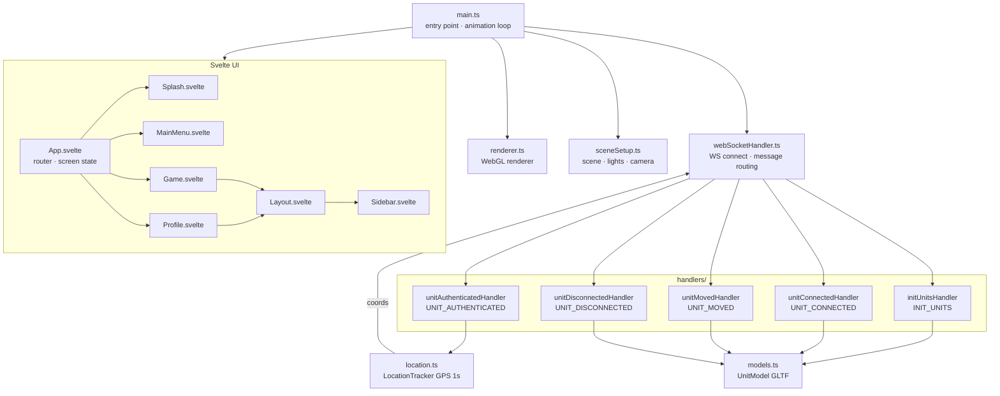

# Client

Frontend Three.js application. Source: [client/src/](../client/src/)

## Entry Point

[main.ts](../client/src/main.ts) — initializes the scene, creates the local unit, starts the WebSocket connection, and runs the animation loop.



## Files

| File | Responsibility |
|------|---------------|
| [main.ts](../client/src/main.ts) | App entry; animation loop; raycaster for click interactions |
| [renderer.ts](../client/src/renderer.ts) | WebGL renderer (antialiasing, transparent background) |
| [sceneSetup.ts](../client/src/sceneSetup.ts) | Three.js scene, lights, GridHelper, camera (FOV ± keys) |
| [models.ts](../client/src/models.ts) | `UnitModel` — loads GLTF, applies color palette, handles scale |
| [webSocketHandler.ts](../client/src/webSocketHandler.ts) | WS connect, message routing, auto-reconnect (5s) |
| [location.ts](../client/src/location.ts) | `LocationTracker` — Geolocation API polling every 1000ms |
| [lighting.ts](../client/src/lighting.ts) | Lighting helper (currently unused) |

## Handlers

Located in [client/src/handlers/](../client/src/handlers/)

| Handler | Triggered by | Action |
|---------|-------------|--------|
| `unitAuthenticatedHandler` | `UNIT_AUTHENTICATED` | Saves own ID, starts LocationTracker, begins sending position |
| `initUnitsHandler` | `INIT_UNITS` | Creates 3D models for all existing users and buildings |
| `unitConnectedHandler` | `UNIT_CONNECTED` | Creates 3D model for newly joined user |
| `unitMovedHandler` | `UNIT_MOVED` | Updates position of a user's model |
| `unitDisconnectedHandler` | `UNIT_DISCONNECTED` | Removes model from scene |

## 3D Models

| Asset | File | Used for |
|-------|------|---------|
| Unit model | `public/assets/funko_test_model.glb` (5.1 MB) | All player units |
| Building | `public/assets/Large Building.glb` (140 KB) | Static BUILDING_A objects |

## Color Palettes

| Entity | Colors |
|--------|--------|
| Own unit | Red, Orange, Gold |
| Other users | Blue, Cyan, Green |

## Development

```bash
# From project root
npm run client
# or
cd client && npm run dev
```

Runs Vite dev server (default port 5173). Requires the server to be running for WebSocket.

## Build

```bash
npm run build-client       # Linux/Mac
npm run build-client-win   # Windows
```

Builds to `client/dist/` then copies to `server/static/` so Express can serve it.

On Heroku this step runs automatically via `heroku-postbuild` in the root `package.json`.
