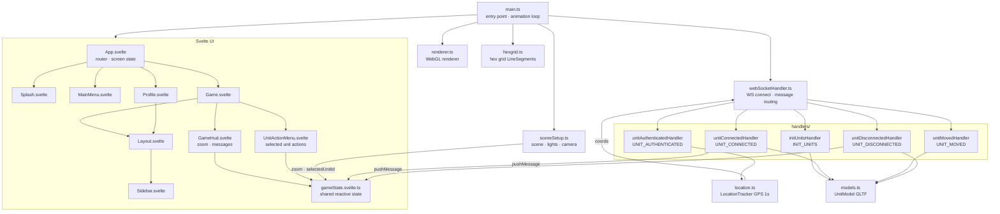

# Client

Frontend Three.js application. Source: [client/src/](../client/src/)

## Entry Point

[main.ts](../client/src/main.ts) — initializes the scene, creates the local unit, starts the WebSocket connection, and runs the animation loop.



## Files

| File | Responsibility |
|------|---------------|
| [main.ts](../client/src/main.ts) | App entry; animation loop; raycaster for click interactions |
| [game.ts](../client/src/game.ts) | Scene init, EffectComposer, OutlinePass, hover/click raycasting, hex grid wiring |
| [hexgrid.ts](../client/src/hexgrid.ts) | `createHexGrid` / `updateHexGrid` — Three.js `LineSegments` hex overlay; hidden at zoom > 25 |
| [renderer.ts](../client/src/renderer.ts) | WebGL renderer (antialiasing, transparent background) |
| [sceneSetup.ts](../client/src/sceneSetup.ts) | Three.js scene, lights, camera; updates `gameState.zoom` on scroll |
| [models.ts](../client/src/models.ts) | `UnitModel` — GLTF, LOD dot sprite, selection ring, `setSelected()` |
| [webSocketHandler.ts](../client/src/webSocketHandler.ts) | WS connect, message routing, auto-reconnect (5s) |
| [location.ts](../client/src/location.ts) | `LocationTracker` — Geolocation API polling every 1000ms |
| [lighting.ts](../client/src/lighting.ts) | Lighting helper (currently unused) |
| [ui/gameState.svelte.ts](../client/src/ui/gameState.svelte.ts) | Shared reactive state: zoom, messages, selectedUnitId |

## Handlers

Located in [client/src/handlers/](../client/src/handlers/)

| Handler | Triggered by | Action |
|---------|-------------|--------|
| `unitAuthenticatedHandler` | `UNIT_AUTHENTICATED` | Saves own ID, starts LocationTracker, begins sending position |
| `initUnitsHandler` | `INIT_UNITS` | Creates 3D models for all existing users and buildings |
| `unitConnectedHandler` | `UNIT_CONNECTED` | Creates 3D model for newly joined user |
| `unitMovedHandler` | `UNIT_MOVED` | Updates position of a user's model |
| `unitDisconnectedHandler` | `UNIT_DISCONNECTED` | Removes model from scene |

## 3D Models

| Asset | File | Used for |
|-------|------|---------|
| Unit model | `public/assets/models-3d/funko_test_model.glb` (5.1 MB) | All player units |
| Building | `public/assets/models-3d/Large Building.glb` (140 KB) | Static BUILDING_A objects |
| Background | `public/assets/images/main-background.jpg` | Main menu / splash background |

## Color Palettes

| Entity | Colors |
|--------|--------|
| Own unit | Red, Orange, Gold |
| Other users | Blue, Cyan, Green |

## Game HUD

A fixed bottom-center overlay visible on the Game screen.

| Component | File | Displays |
|-----------|------|---------|
| `GameHud` | `components/hud/GameHud.svelte` | Container; shows `MessageLog` only |
| `ZoomDisplay` | `components/hud/ZoomDisplay.svelte` | Current camera zoom value (used inside `ZoomSlider`) |
| `MessageLog` | `components/hud/MessageLog.svelte` | Last incoming event message (auto-clears after 4s) |

## Zoom Slider

`ZoomSlider.svelte` — vertical slider on the left side of the screen (mobile-friendly).

- Logarithmic scale: range 0.05× – 200×
- Displays current zoom value below the slider
- Drag does not jerk: local state decoupled from `gameState.zoom` during interaction
- Syncs with mouse wheel via `$effect` when not dragging
- `sceneSetup.setupCamera()` returns `setZoom(value)`, wired to `gameState` via `wireSetZoom()`

## Mobile

- Pinch zoom disabled via `user-scalable=no` in viewport meta and `touch-action: none` on the canvas
- Zoom controlled via `ZoomSlider` on the left side

## Unit Selection

Clicking a non-own unit:
- Highlights it with a green outline (`OutlinePass`) in 3D model mode
- Shows a green selection ring sprite in dot LOD mode
- Opens `UnitActionMenu` above the HUD with unit ID and action buttons
- Deselects previous unit before selecting the new one

Clicking empty space or pressing ✕ dismisses the selection.

## Development

```bash
# From project root
npm run client
# or
cd client && npm run dev
```

Runs Vite dev server (default port 5173). Requires the server to be running for WebSocket.

## Build

```bash
npm run build-client       # Linux/Mac
npm run build-client-win   # Windows
```

Builds to `client/dist/` then copies to `server/static/` so Express can serve it.

On Heroku this step runs automatically via `heroku-postbuild` in the root `package.json`.
