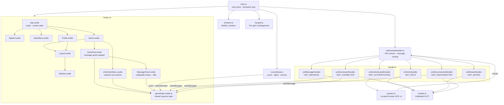

# Client

Frontend Three.js application. Source: [client/src/](../../client/src/)

## Entry Point

[main.ts](../../client/src/main.ts) — initializes the scene, creates the local unit, starts the WebSocket connection, and runs the animation loop.



## Files

| File                                                           | Responsibility                                                                                            |
| -------------------------------------------------------------- | --------------------------------------------------------------------------------------------------------- |
| [main.ts](../../client/src/main.ts)                               | App entry; animation loop; raycaster for click interactions                                               |
| [game.ts](../../client/src/game.ts)                               | Scene init, EffectComposer, OutlinePass, hover/click raycasting, hex grid wiring                          |
| [hexgrid.ts](../../client/src/hexgrid.ts)                         | `createHexGrid` / `updateHexGrid` — Three.js `LineSegments` hex overlay; hidden at zoom > 25              |
| [renderer.ts](../../client/src/renderer.ts)                       | WebGL renderer (antialiasing, transparent background)                                                     |
| [sceneSetup.ts](../../client/src/sceneSetup.ts)                   | Three.js scene, lights, camera; updates `gameState.zoom` on scroll                                        |
| [models.ts](../../client/src/models.ts)                           | `UnitModel` — GLTF, LOD dot sprite, selection ring, `setSelected()`; dot size formula uses `renderer.domElement.clientHeight` (not `window.innerHeight`) to stay constant on iOS Safari |
| [webSocketHandler.ts](../../client/src/webSocketHandler.ts)       | WS connect/disconnect, message routing, auto-reconnect (5s); `disconnectWebSocket()` stops reconnect loop |
| [location.ts](../../client/src/location.ts)                       | `LocationTracker` — Geolocation API polling; interval configured by server on auth                        |
| [lighting.ts](../../client/src/lighting.ts)                       | Lighting helper (currently unused)                                                                        |
| [ui/gameState.svelte.ts](../../client/src/ui/gameState.svelte.ts) | Shared reactive state: zoom, messages (TTL), messageHistory (last 500), selectedUnitId, messagingMode     |

## Handlers

Located in [client/src/handlers/](../../client/src/handlers/)

| Handler                    | Triggered by         | Action                                                                          |
| -------------------------- | -------------------- | ------------------------------------------------------------------------------- |
| `unitAuthenticatedHandler` | `UNIT_AUTHENTICATED` | Saves own ID, starts LocationTracker, begins sending position                   |
| `initUnitsHandler`         | `INIT_UNITS`         | Clears stale units, then creates 3D models for all existing users and buildings |
| `unitConnectedHandler`     | `UNIT_CONNECTED`     | Creates 3D model for newly joined user                                          |
| `unitMovedHandler`         | `UNIT_MOVED`         | Updates position of a user's model                                              |
| `unitDisconnectedHandler`  | `UNIT_DISCONNECTED`  | Removes model from scene                                                        |
| `unitMessageHandler`       | `UNIT_MESSAGE`       | Pushes `[senderId]: text` to `gameState.messages` (TTL 8 s); shown in GameHud  |

## 3D Models

| Asset      | File                                                    | Used for                      |
| ---------- | ------------------------------------------------------- | ----------------------------- |
| Unit model | `public/assets/models-3d/funko_test_model.glb` (5.1 MB) | All player units              |
| Building   | `public/assets/models-3d/Large Building.glb` (140 KB)   | Static BUILDING_A objects     |
| Background | `public/assets/images/main-background.png`              | Main menu / splash background |

## Color Palettes

| Entity      | Colors            |
| ----------- | ----------------- |
| Own unit    | Red, Orange, Gold |
| Other users | Blue, Cyan, Green |

## Theming

The accent color adapts to the player's faction using CSS custom properties.

| Faction           | Class                       | `--accent`        |
| ----------------- | --------------------------- | ----------------- |
| zombies (default) | _(none)_                    | `#72b53a` (green) |
| humans            | `.theme-humans` on `<body>` | `#3a8ab5` (blue)  |

`App.svelte` applies the class via a `$effect` keyed to `gameState.faction`. All UI components reference `var(--accent)` and `rgba(var(--accent-rgb), …)` — never hardcoded hex values. The faction is fetched from `GET /api/profile` after login and after token refresh.

## Game HUD

Fixed overlays visible on the Game screen.

| Component      | File                                 | Displays                                                                 |
| -------------- | ------------------------------------ | ------------------------------------------------------------------------ |
| `GameHud`      | `components/hud/GameHud.svelte`      | Thin wrapper that renders `MessagePanel`                                 |
| `MessagePanel` | `components/hud/MessagePanel.svelte` | Collapsible message history (bottom-left); see below                     |
| `ZoomDisplay`  | `components/hud/ZoomDisplay.svelte`  | Current camera zoom value (used inside `ZoomSlider`)                     |

### MessagePanel

Fixed to the bottom-left of the screen. Sources data from `gameState.messageHistory` (last 500 entries, never expire).

- **Collapsed** — shows the most recent message in a single bar with a ▲ toggle button
- **Expanded** — scrollable list capped at 10 visible lines (`12px × 1.4 × 10`); auto-scrolls to bottom on new messages
- **Sender filter** — messages formatted as `[Username]: text` render the `[Username]` part as a clickable button; clicking it filters the history to that sender only
- **Filter chip** — while a filter is active a `Username ✕` chip appears in the bar; clicking it clears the filter
- System messages (no `[Name]:` prefix) are rendered as plain text and are never filterable

## Zoom Slider

`ZoomSlider.svelte` — vertical slider on the left side of the screen (mobile-friendly).

- Logarithmic scale: range 0.05× – 200×
- Displays current zoom value below the slider
- Drag does not jerk: local state decoupled from `gameState.zoom` during interaction
- Syncs with mouse wheel via `$effect` when not dragging
- `sceneSetup.setupCamera()` returns `setZoom(value)`, wired to `gameState` via `wireSetZoom()`

## Mobile

- Pinch zoom disabled via `user-scalable=no` in viewport meta and `touch-action: none` on the canvas
- Zoom controlled via `ZoomSlider` on the left side

## Unit Selection

Clicking a non-own unit:

- Highlights it with a green outline (`OutlinePass`) in 3D model mode
- Shows a green selection ring sprite in dot LOD mode
- Opens `UnitActionMenu` above the HUD with unit ID and action buttons
- Deselects previous unit before selecting the new one

Clicking empty space or pressing ✕ dismisses the selection.

Clicking **Message** opens an inline text input (max `UNIT_MESSAGE_MAX_LENGTH` chars, defined in `lib/constants.ts`). Enter sends the message; Escape cancels. A remaining-character counter is shown next to the field and turns highlighted when fewer than 10 % of characters remain. The server routes the message only to the target player's socket using the JWT-verified sender ID.

## Testing

Tests use [Vitest](https://vitest.dev/) with the `jsdom` environment (for `localStorage`, `fetch`).

```bash
cd client && npm test              # run all tests
cd client && npm run test:coverage # run with HTML coverage report
```

| Test file                                                                                                | Covers                                                                                                                                    |
| -------------------------------------------------------------------------------------------------------- | ----------------------------------------------------------------------------------------------------------------------------------------- |
| [`__tests__/auth.test.ts`](../../client/src/__tests__/auth.test.ts)                                         | `setTokens`, `getAccessToken`, `getPlayerId`, `hasSession`, `clearSession`, `refreshAccessToken`                                          |
| [`__tests__/handlers.test.ts`](../../client/src/__tests__/handlers.test.ts)                                 | `handleUnitMoved`, `handleUnitDisconnected`, `handleUnitConnected`, `handleInitUnits`; ghost-player regression                            |
| [`__tests__/unitAuthenticatedHandler.test.ts`](../../client/src/__tests__/unitAuthenticatedHandler.test.ts) | `handleUnitAuthenticated`: setup, first/subsequent location updates, reconnect behaviour                                                  |
| [`__tests__/webSocketHandler.test.ts`](../../client/src/__tests__/webSocketHandler.test.ts)                 | `disconnectWebSocket`: no auto-reconnect after disconnect, cleans up socket; `connectWebSocket`: closes previous socket on account switch |
| [`__tests__/lodDotSize.test.ts`](../../client/src/__tests__/lodDotSize.test.ts)                             | LOD dot size formula: constant at any zoom/position; regression for `window.innerHeight` vs renderer height divergence on iOS |

Coverage reports are written to `client/coverage/` (git-ignored).

## Development

```bash
# From project root
npm run client
# or
cd client && npm run dev
```

Runs Vite dev server (default port 5173). Requires the server to be running for WebSocket.

## Build

```bash
npm run build-client       # Linux/Mac
npm run build-client-win   # Windows
```

Builds to `client/dist/` then copies to `server/static/client/` so Express can serve it.
