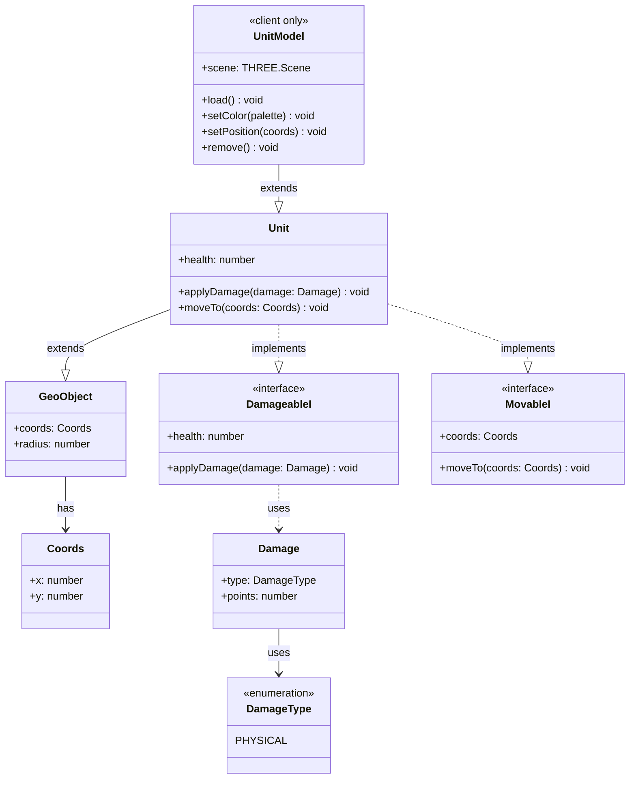

# Shared Library (`lib/`)

Shared TypeScript code used by both client and server (and potentially other consumers).

## Files

### Geo

| File | Exports | Description |
|------|---------|-------------|
| [lib/geo/coords.ts](../lib/geo/coords.ts) | `Coords` | Wrapper around `{ x, y }` with getters/setters |
| [lib/geo/geo-object.ts](../lib/geo/geo-object.ts) | `GeoObject` | Base class with `coords: Coords` and `radius: number`; stub for collision detection |
| [lib/geo/constants.ts](../lib/geo/constants.ts) | `metersToLatDegrees`, `metersToLonDegrees` | Geographic unit conversion |

#### Coordinate Conversion

```typescript
// 1 degree latitude ≈ 111320 meters (constant)
metersToLatDegrees(meters: number): number

// 1 degree longitude varies with latitude (cos factor)
metersToLonDegrees(meters: number, latitudeDegrees: number): number
```

### Units

| File | Exports | Description |
|------|---------|-------------|
| [lib/units/unit.ts](../lib/units/unit.ts) | `Unit` | Extends `GeoObject`; implements `DamageableI` and `MovableI`; default health = 250 |

### Objects

| File | Exports | Description |
|------|---------|-------------|
| [lib/objects/trap.ts](../lib/objects/trap.ts) | `Trap` | (Stub, appears unused in current codebase) |

### Shared Interfaces & Types

| File | Exports | Description |
|------|---------|-------------|
| [lib/interfaces.ts](../lib/interfaces.ts) | `DamageableI`, `MovableI` | `DamageableI`: `health`, `applyDamage()`; `MovableI`: `coords`, `moveTo()` |
| [lib/damages.ts](../lib/damages.ts) | `DamageType`, `Damage` | `DamageType` enum (`PHYSICAL`); `Damage` class with `points: number` |

## Class Hierarchy


