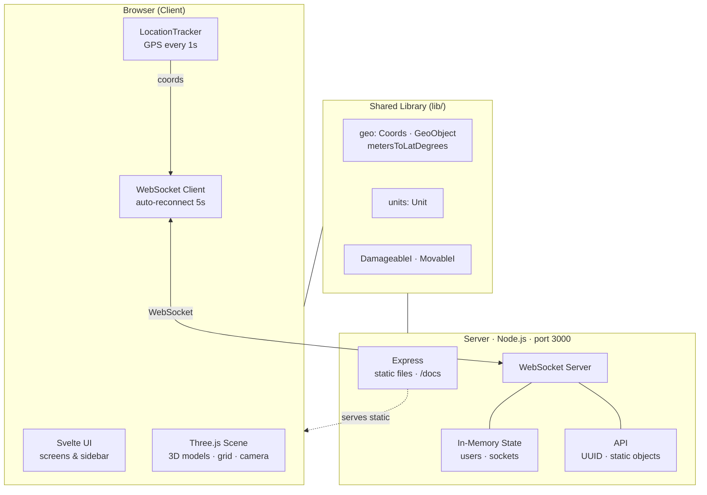

# Hives — Project Overview

A real-time multiplayer 3D visualization of user geographic positions built with Three.js on the frontend and Express + WebSocket on the backend.

## What It Does

Multiple browser clients connect to a shared WebSocket server. Each client tracks the device's GPS position and broadcasts it in real time. All connected users appear as 3D models on a shared geographic grid, making it possible to see where everyone is relative to each other.

## Architecture



## Monorepo Layout

```
hives/
├── client/       # Frontend — Three.js 3D app (TypeScript + Vite)
├── server/       # Backend  — Express + WebSocket server (TypeScript)
├── lib/          # Shared   — Geo math, Unit class, interfaces
├── messaging/    # Firebase config (stub, not integrated)
├── old/          # Archived legacy code (Passport/Sequelize/PostgreSQL)
├── docs/         # This documentation
├── Procfile      # Heroku deployment
└── package.json  # Root workspace scripts
```

## Tech Stack

| Layer | Technology |
|-------|-----------|
| 3D rendering | Three.js 0.183 |
| Frontend build | Vite 8.0 |
| Frontend language | TypeScript 5.2 |
| Backend | Express 4.21, Node.js ≥ 24 |
| Real-time | WebSocket (`ws` 8.18) |
| IDs | UUID v4 |
| Deployment | Heroku (client + server) |

## Key Constraints

- **No database** — all state is in-memory; lost on server restart.
- **No authentication** — UUID assigned on first connect.
- **No persistence** — reconnecting creates a new user identity.
- **Gdansk-centered** — static objects and default coordinates are near 54.38°N 18.57°E.
