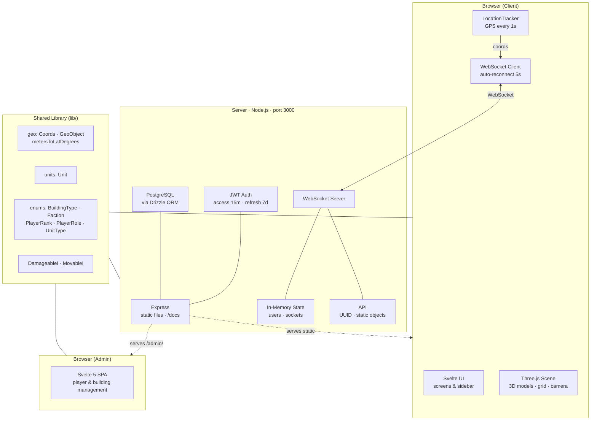

# Hives — Project Overview

A real-time multiplayer 3D visualization of user geographic positions built with Three.js on the frontend and Express + WebSocket on the backend.

## What It Does

Multiple browser clients connect to a shared WebSocket server. Each client tracks the device's GPS position and broadcasts it in real time. All connected users appear as 3D models on a shared geographic grid, making it possible to see where everyone is relative to each other. Players authenticate with username/password, and their positions and stats are persisted to a PostgreSQL database.

## Architecture


```mermaid
graph TB
    subgraph Browser["Browser (Client)"]
        Svelte["Svelte UI\nscreens & sidebar"]
        ThreeJS["Three.js Scene\n3D models · grid · camera"]
        WS_Client["WebSocket Client\nauto-reconnect 5s"]
        GPS["LocationTracker\nGPS every 1s"]
    end

    subgraph AdminSPA["Browser (Admin)"]
        AdminUI["Svelte 5 SPA\nplayer & building management"]
    end

    subgraph Server["Server · Node.js · port 3000"]
        Express["Express\nstatic files · /docs"]
        WS_Server["WebSocket Server"]
        State["In-Memory State\nusers · sockets"]
        API["API\nUUID · static objects"]
        Auth["JWT Auth\naccess 15m · refresh 7d"]
        DB["PostgreSQL\nvia Drizzle ORM"]
    end

    subgraph Lib["Shared Library (lib/)"]
        Geo["geo: Coords · GeoObject\nmetersToLatDegrees"]
        Units["units: Unit"]
        Enums["enums: BuildingType · Faction\nPlayerRank · PlayerRole · UnitType"]
        Interfaces["DamageableI · MovableI"]
    end

    GPS -->|coords| WS_Client
    WS_Client <-->|WebSocket| WS_Server
    WS_Server --- State
    WS_Server --- API
    Express -.->|serves static| Browser
    Express -.->|serves /admin/| AdminSPA
    Auth --- Express
    DB --- Express
    Lib --- Browser
    Lib --- AdminSPA
    Lib --- Server
```

## Monorepo Layout

```
hives/
├── client/       # Frontend — Three.js 3D app (TypeScript + Vite)
├── admin/        # Admin UI — Svelte 5 player/building management panel
├── server/       # Backend  — Express + WebSocket server (TypeScript)
├── lib/          # Shared   — Geo math, Unit class, enums, interfaces
│   └── enums.ts  # BuildingType, PlayerRank, PlayerRole, Faction, UnitType
├── docs/         # This documentation
└── package.json  # Root workspace scripts
```

## Tech Stack

| Layer | Technology |
|-------|-----------|
| 3D rendering | Three.js 0.183 |
| Frontend build | Vite 8.0 |
| Frontend language | TypeScript 5.2 |
| Backend | Express 4.21, Node.js ≥ 24 |
| Real-time | WebSocket (`ws` 8.18) |
| Database | PostgreSQL via Drizzle ORM |
| Authentication | JWT (access 15m + refresh 7d, bcrypt passwords) |
| IDs | UUID v4 |
| Admin panel | Svelte 5 SPA at `/admin/` |
| Deployment | VDS at `incuby.duckdns.org`, pm2 + Nginx |

## Key Facts

- **PostgreSQL database** — player data, positions, and buildings persisted via Drizzle ORM.
- **JWT authentication** — access token (15m, in-memory) + refresh token (7d, localStorage).
- **Data persistence** — players, positions, and buildings survive server restarts.
- **Admin panel** — Svelte 5 SPA at `/admin/` for managing players and buildings.
- **Gdansk-centered** — static objects and default coordinates are near 54.38°N 18.57°E.
- **Deployment** — VDS at `incuby.duckdns.org`; Nginx terminates TLS, proxies to port 3000; process managed by pm2 (`hives`).
