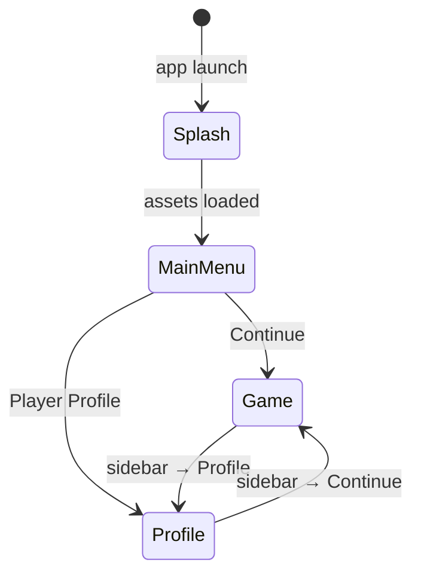

# Screen Transitions — Hives

## Screens

| Screen | Component | Description |
|---|---|---|
| Splash | `Splash.svelte` | Dimmed background with animated spinner. Shown while Three.js initialises. |
| Main Menu | `MainMenu.svelte` | HIVES title (animates in large, shrinks on transition), "Continue" and "Player Profile" buttons. |
| Game | `Game.svelte` | Three.js map rendered fullscreen. Svelte overlay shows only the sidebar toggle button. |
| Profile | `Profile.svelte` | Attribute, skill, and role tables (stub values). Includes language switcher (EN / RU). |

## Navigation — Sidebar

Game and Profile screens share a sidebar panel (opened via `☰`):

| Screen | Sidebar buttons |
|---|---|
| Game | Continue *(disabled — current)*, Profile |
| Profile | Continue, Profile *(disabled — current)* |

Clicking a button navigates and closes the sidebar. Clicking the backdrop also closes it.

## Components

| Component | Role |
|---|---|
| `App.svelte` | Router — owns `screen` state, persistent background and title layers |
| `HivesTitle.svelte` | Persistent "HIVES" heading; `font-size` transitions between splash (large) and menu (small) |
| `Layout.svelte` | Wrapper for Game and Profile; renders `MenuButton` and `Sidebar` |
| `MenuButton.svelte` | `☰` toggle button, fixed top-left |
| `Sidebar.svelte` | Slide-in panel with navigation actions; supports `disabled` state per action |

## i18n

Localisation via `svelte-i18n`. Default locale: **en**. Supported: `en`, `ru`.
Language switcher is available on the Profile screen.

Locale files: `client/src/i18n/en.json`, `client/src/i18n/ru.json`

## z-index Layers

| z-index | Layer |
|---|---|
| 0 | Three.js canvas (`.game-layer`) |
| 1 | Background image (`.bg`) |
| 10 | Svelte screen overlays (`Layout`) |
| 15 | `HivesTitle` |
| 20 | Splash screen |
| 90 | Sidebar backdrop |
| 100 | `MenuButton`, `Sidebar` panel |
