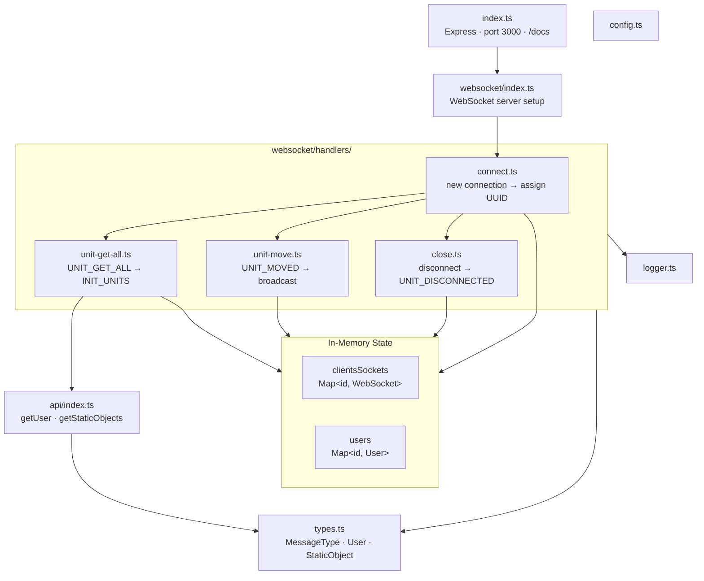

# Server

Express + WebSocket backend. Source: [server/src/](../server/src/)

## Files

| File | Responsibility |
|------|---------------|
| [index.ts](../server/src/index.ts) | Express app; serves `static/` on port 3000; renders `docs/*.md` at `/docs` with Mermaid diagrams via CDN |
| [types.ts](../server/src/types.ts) | Shared TypeScript types: `MessageType`, `User`, `Coordinates`, `SocketMessage`, `StaticObject` |
| [api/index.ts](../server/src/api/index.ts) | `getUser()` — creates a new user with UUID; `getStaticObjects()` — returns 2 hardcoded buildings near Gdansk |
| [websocket/index.ts](../server/src/websocket/index.ts) | WebSocket server setup; delegates to connection handler |



## WebSocket Handlers

Located in [server/src/websocket/handlers/](../server/src/websocket/handlers/)

| Handler | Trigger | Action |
|---------|---------|--------|
| `connect.ts` | New WS connection | Assigns UUID, adds to maps, routes messages, registers close handler |
| `unit-get-all.ts` | `UNIT_GET_ALL` message | Sends `INIT_UNITS` with all users + static objects |
| `unit-move.ts` | `UNIT_MOVED` message | Updates user coords in map; broadcasts to all other clients |
| `close.ts` | Connection closed | Removes user from maps; broadcasts `UNIT_DISCONNECTED` |

## Port

Server listens on **port 3000** (or `process.env.PORT` if set).

## State

All state is in-memory (no database). Two `Map` objects:

```typescript
clientsSockets: Map<string, WebSocket>  // socketId → socket
users: Map<string, User>                // socketId → user data
```

State is lost on server restart.

## Development

```bash
# Compile TypeScript
cd server && npm run build

# Watch TypeScript changes
cd server && npm run watch-ts

# Run compiled output with nodemon
cd server && npm run dev

# Build + run (used in production)
npm run server  # from project root
```

## Static Objects

Two buildings are hardcoded in `api/index.ts`:
- `building-1` at approximately (54.376°N, 18.569°E) offset by 150m N/E
- `building-2` at approximately (54.376°N, 18.569°E) offset by 100m S/W

## Deployment

Both client and server deploy to **Heroku** from a single dyno.

`Procfile` (server process):
```
web: cd server && npm install --include=dev && npm start
```

Root `package.json` `heroku-postbuild` (runs before Procfile, builds client):
```
npm install --prefix ./client && npm run build --prefix ./client && cp -r ./client/dist/* ./server/static/
```

The built client ends up in `server/static/` and is served by Express at the root URL.
